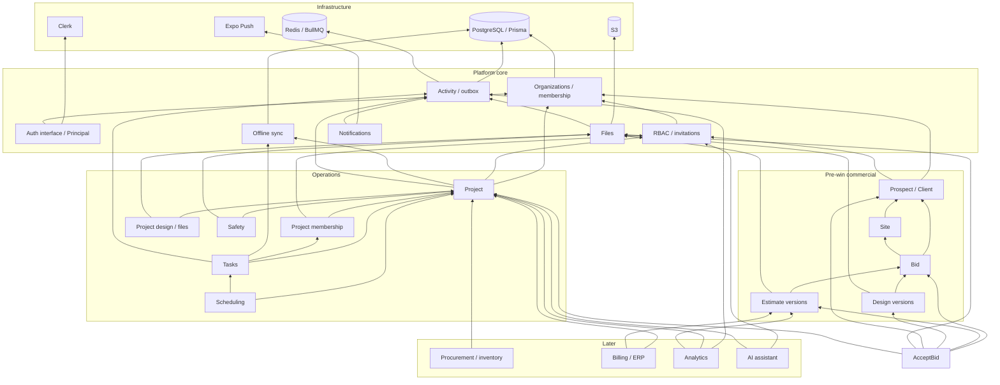

# Backend dependency map

This map describes what each capability requires. It is not the product lifecycle or the implementation schedule. See the [commercial domain model](../product/domain-model.md) for entity meaning and the [delivery roadmap](../product/roadmap.md) for sequencing.

## Dependency rule

```text
feature modules → platform core → infrastructure implementations
```

Platform core never imports product modules. Feature modules call another module's public application services or consume its domain events; they do not import another module's repository. Every tenant-owned record carries `organization_id`, and operational records also carry `project_id` once a project exists.

## Capability layers

| Layer                             | Capabilities                                                                                           | What it establishes                                           |
| --------------------------------- | ------------------------------------------------------------------------------------------------------ | ------------------------------------------------------------- |
| Infrastructure                    | PostgreSQL and Prisma, Redis and BullMQ, S3, Clerk implementation, Expo Push implementation            | Persistence, queues, object storage, authentication, delivery |
| Platform core                     | Principal, organizations, memberships, RBAC, invitations, files, activity, notifications, sync, outbox | Tenant scope, authorization, shared reliability               |
| Pre-win commercial                | Prospect/client relationship, site, bid, estimate versions, design versions                            | Commercial history before a job exists                        |
| Win boundary                      | `AcceptBid` transaction and `BidAccepted` event                                                        | Auditable conversion into a client and project                |
| Operations                        | Project, project membership, tasks, project design/files, scheduling, safety                           | Delivery after a win or direct project creation               |
| Commercial operations and insight | Procurement, inventory, billing, accounting integrations, analytics, AI                                | Capabilities built on stable operational and commercial facts |

## Full dependency graph

Arrows mean “depends on.”



## Critical edges

### Identity to authorization

The authentication implementation verifies the external identity and resolves an internal `Principal`. Organization membership selects the tenant. RBAC adds organization and project permissions. No tenant-owned capability is reachable without this chain.

### Pre-win commercial chain

A bid requires a prospect and may identify a site. Estimate and design versions require a bid. Files remain a platform capability and are attached through authorized references rather than owned storage code in each feature.

This dependency means the minimal prospect/client, site, and bid model must exist before the estimates product can be implemented. Geographic pipeline views and other advanced CRM experiences can still wait until a later phase.

### Win boundary

`AcceptBid` depends on the bid, selected estimate and design versions, prospect/client relationship, files, organizations, and project creation service. It synchronously commits the commercial conversion and an outbox record. Activity, notifications, document processing, and integrations consume the resulting `BidAccepted` event asynchronously.

### Operational spine

Project membership depends on project and RBAC. Tasks depend on the project and its membership rules. Scheduling and safety extend stable project, task, and file identities. Activity and offline sync observe the operational modules through public contracts and events.

A Phase 1 direct-project command can depend on organizations and RBAC without fabricating a prospect or bid. This allows the field slice to ship before the pre-win commercial chain while keeping `Project` operational in meaning.

### Later capabilities

Procurement and inventory need stable projects and locations. Billing needs the project plus the accepted commercial baseline. Analytics consumes activity and domain facts. AI tools use the same application services and authorization as human clients.

## Minimum dependency matrix

| Capability                     | Minimum dependencies                                                                 |
| ------------------------------ | ------------------------------------------------------------------------------------ |
| Prospect / client / site       | Auth, organization, RBAC, PostgreSQL                                                 |
| Bid                            | Organization, RBAC, prospect/client, site                                            |
| Estimate version               | Bid, files                                                                           |
| Design version                 | Bid, files                                                                           |
| `AcceptBid`                    | Bid, selected estimate/design versions, relationship, files, project service, outbox |
| Direct project creation        | Organization, RBAC                                                                   |
| Project membership             | Project, organization, RBAC                                                          |
| Tasks                          | Project, project membership                                                          |
| Project design and field files | Project, files                                                                       |
| Activity and real-time updates | Outbox/activity plus organization or project scope                                   |
| Offline sync                   | Sync core plus projects, tasks, and file metadata                                    |
| Scheduling                     | Projects, tasks, teams                                                               |
| Safety                         | Projects, files, activity                                                            |
| Procurement and inventory      | Projects, organizations, locations                                                   |
| Billing and accounting         | Projects, accepted commercial baseline, accounting interface                         |
| Analytics and AI               | RBAC plus the domains each use                                                       |
