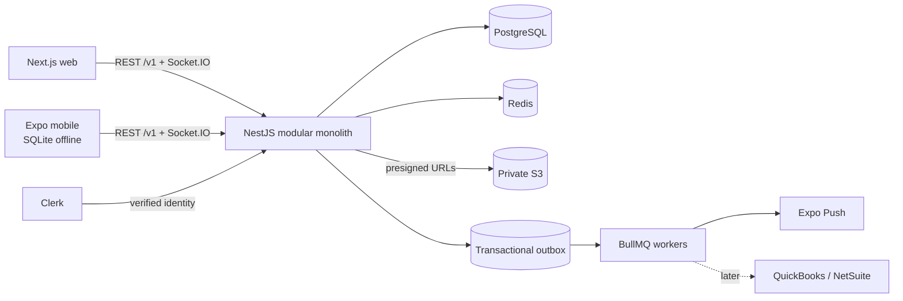

# System overview

## Context

Keystone serves general contractors, subcontractor organizations, office administrators, and field crews through one web client and one mobile client. A unified NestJS backend owns business rules and authorization.



## Request flow

1. Clerk proves the external identity.
2. The auth implementation resolves an internal `Principal` containing the user, organization membership, and active scope.
3. Guards check route permissions; application services check tenant and resource ownership again.
4. The service commits the business change and any outbox event in one PostgreSQL transaction.
5. Workers process asynchronous side effects. Socket.IO publishes focused live updates; it is not the primary CRUD transport.

## Dependency direction

```text
controller / gateway
        ↓
application service / use case
        ↓
interface owned by the domain
        ↑
infrastructure implementation (Prisma, Clerk, S3, Expo Push)
```

Product modules may depend on platform capabilities. Platform core cannot depend on product modules. Cross-module behavior uses a public application service for synchronous work or a domain event for fan-out.

## Deployment shape

Phase 1 uses one codebase with separately runnable API and worker processes. It begins in one AWS region. A module becomes a separate service only after independent scale, release cadence, ownership, or failure isolation provides a concrete benefit.
