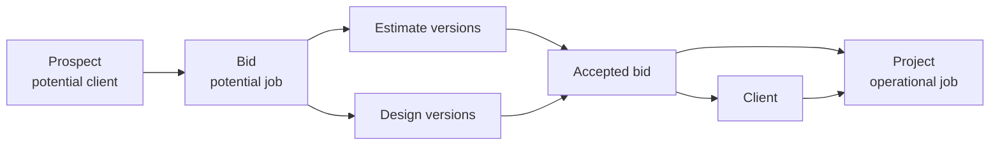

# Preliminary commercial domain model

Status: **Provisional**. The identities and conversion boundary below guide schema and API design, but the implementation details marked as open must be resolved before the corresponding module is built.

## Commercial path



In application language, `AcceptBid` is the command and transaction that creates the accepted result. `BidAccepted` is the event emitted after the transaction commits. “Accepted bid” describes the durable conversion record or state; it is not a second project.

## Identities that stay separate

| Identity         | Meaning                                                                               | Lifecycle rule                                                                  |
| ---------------- | ------------------------------------------------------------------------------------- | ------------------------------------------------------------------------------- |
| Organization     | The contractor or subcontractor company using Keystone                                | Hard tenant boundary; never represents a customer                               |
| Prospect         | A potential client known to one organization                                          | Can own sites and bids before any work is won                                   |
| Client           | The customer relationship after work is won                                           | Promotion must preserve the prospect's identity and history                     |
| Site             | A physical place belonging to a prospect or client                                    | One customer can have many sites; one site can have many projects over time     |
| Bid              | A potential job or commercial pursuit                                                 | Lost or abandoned bids never become projects                                    |
| Estimate version | A priced revision prepared for a bid                                                  | Acceptance pins the exact winning version                                       |
| Design version   | A revision of a survey, drawing, system design, or proposal design prepared for a bid | Acceptance pins the exact approved set or manifest                              |
| Accepted bid     | The auditable boundary between pursuit and delivery                                   | Records the selected commercial artifacts and resulting project                 |
| Project          | The operational job after a win, or a directly created job when no bid exists         | Owns execution, membership, tasks, field files, and later operational revisions |

`Organization ≠ Prospect/Client` and `Bid ≠ Project` are invariants. A prospect becoming a client is a lifecycle promotion, not the creation of a new tenant. A bid becoming accepted creates a project; the bid remains available as commercial history.

## Aggregate relationships

```text
Organization
├── memberships and permissions
├── prospects / clients
│   ├── sites
│   └── bids
│       ├── estimate versions
│       ├── design versions
│       ├── proposal files
│       └── acceptance record(s)
└── projects
    ├── client and site link
    ├── accepted-bid source link, when applicable
    ├── as-sold commercial baseline
    ├── project memberships
    ├── tasks and field execution
    └── project design and file revisions
```

Every row above is organization-scoped. Project execution can be shared with another organization only through explicit project membership. Pre-win bid access does not automatically grant project access, and project access does not expose unrelated bids.

## Versioning rules

Estimate and design history is immutable after a version is issued or included in an acceptance. Editing creates a new version with its own author, timestamp, status, and source version. Draft versions may have a narrower editing policy, but an issued or accepted version is never changed in place.

Acceptance stores an immutable manifest of the selected artifacts. At minimum it identifies the winning estimate version and the accepted design versions or design-set revision. This preserves the “as sold” baseline even after project teams create new budgets, change orders, shop drawings, or construction revisions.

The project becomes the home for ongoing operational work. The acceptance manifest keeps links to the pre-win originals; project-owned successors must not erase or silently rewrite those originals.

## `AcceptBid` transaction

The acceptance use case runs as one database transaction and:

1. verifies the bid, selected versions, organization scope, and caller permissions;
2. records the accepted bid and the exact estimate/design manifest;
3. promotes the prospect relationship to client, idempotently;
4. creates the project linked to the client, site, bid, and acceptance;
5. creates the project's immutable as-sold baseline;
6. establishes the initial internal project memberships;
7. marks the bid accepted without deleting its pre-win history; and
8. writes a `BidAccepted` event to the transactional outbox.

Retries with the same idempotency key return the same acceptance and project. Notification, activity projection, document processing, and external integration work occurs after commit through the outbox. Their failure never rolls back the accepted commercial transaction.

A lost or abandoned bid produces no project. A future partial or split award may produce multiple projects, so the physical schema must not assume forever that one bid can reference only one project.

## Direct project creation

Phase 1 can create a project without a bid because the field loop is delivered before the commercial modules. A directly created project has an explicit source such as `direct`; it must not create a fake bid or use a `bidding` project status. The later accepted-bid path creates projects through the same project application service and preserves the same project invariants.

## Ownership by module

| Module                   | Owns                                                                                      |
| ------------------------ | ----------------------------------------------------------------------------------------- |
| Organizations and access | Organizations, users, memberships, permissions, invitations                               |
| Relationships            | Prospect/client lifecycle and sites                                                       |
| Bids                     | Bid lifecycle, acceptance state, and acceptance orchestration                             |
| Estimates                | Estimate versions, line items, alternates, and issued status                              |
| Design                   | Pre-win design versions and project design revisions                                      |
| Files                    | Storage metadata and authorized attachment references                                     |
| Projects                 | Projects, project memberships, execution state, tasks, and the as-sold baseline reference |
| Activity and outbox      | Durable event delivery and user-facing history projections                                |

`AcceptBid` is a synchronous application workflow across public module interfaces inside the modular monolith. Modules do not reach into one another's repositories.

## Open decisions

Resolve these before implementing the commercial modules:

- whether prospect and client are one party record with lifecycle state or separate records linked by promotion;
- whether a bid can have one active estimate stream or several priced options;
- whether acceptance selects one design-set version or a manifest of independently versioned design artifacts;
- the post-win name and structure for the accepted estimate, budget, or contract value;
- rules for partial awards, split projects, rebids, and multiple accepted scopes;
- how change orders relate to the as-sold baseline;
- which proposal and design artifacts are copied, linked, or represented through immutable attachment manifests; and
- pre-win collaboration and customer-portal permissions.

These choices may change the physical schema. They do not change the identity boundaries or the rule that acceptance pins an auditable commercial baseline before project execution begins.
