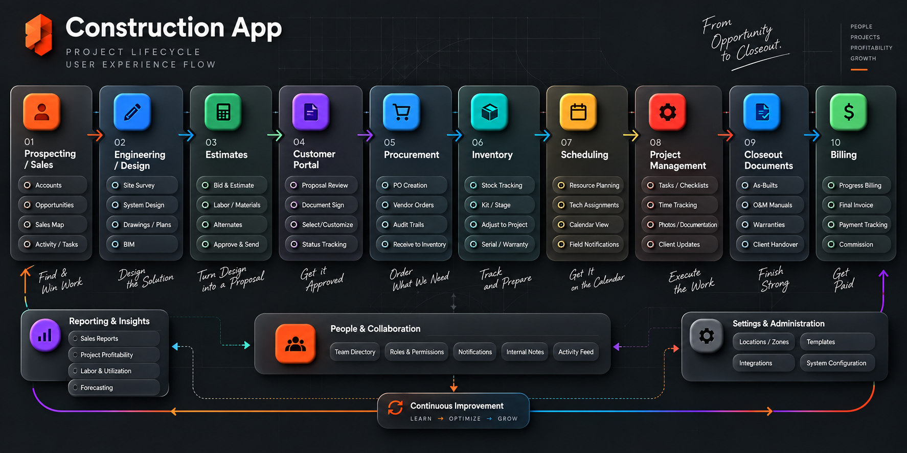

# Construction project lifecycle

This is the target end-to-end user experience for moving work from an opportunity through project execution, closeout, billing, and payment. It defines the product’s workflow and capability map and is interpreted through the [rebuild guardrails](rebuild-guardrails.md). It is not the sequence in which the software must be implemented; see the [delivery roadmap](roadmap.md) for build phases.



## Lifecycle stages

| Stage                   | Outcome                          | Capabilities shown in the approved flow                                             |
| ----------------------- | -------------------------------- | ----------------------------------------------------------------------------------- |
| 1. Prospecting / Sales  | Find and win work                | Accounts, opportunities, sales map, activity and tasks                              |
| 2. Engineering / Design | Design the solution              | Site survey, system design, drawings and plans, BIM                                 |
| 3. Estimates            | Turn the design into a proposal  | Bid and estimate, labor and materials, alternates, approve and send                 |
| 4. Customer Portal      | Get the proposal approved        | Proposal review, document signing, selections and customization, status tracking    |
| 5. Procurement          | Order what the project needs     | Purchase-order creation, vendor orders, audit trails, receiving into inventory      |
| 6. Inventory            | Track and prepare materials      | Stock tracking, kits and staging, project adjustments, serial and warranty tracking |
| 7. Scheduling           | Put the work on the calendar     | Resource planning, technician assignments, calendar views, field notifications      |
| 8. Project Management   | Execute the work                 | Tasks and checklists, time tracking, photos and documentation, client updates       |
| 9. Closeout Documents   | Complete a strong handover       | As-builts, operation and maintenance manuals, warranties, client handover           |
| 10. Billing             | Invoice, collect, and compensate | Progress billing, final invoice, payment tracking, commission                       |

## Commercial conversion path

The first four experience stages produce one explicit domain transition:

```text
Prospect → Bid → versioned Estimates + versioned Designs → Accepted bid → Client + Project
```

A prospect is a potential client, and a bid is a potential job. Estimate and design revisions remain attached to the bid until acceptance. The `AcceptBid` transaction pins the approved versions, promotes the prospect relationship to client, and creates the operational project with an immutable as-sold baseline. Lost or abandoned bids never appear as projects.

See the [preliminary commercial domain model](domain-model.md) for identities, versioning, and open questions. This domain flow does not change the delivery order: Phase 1 may create projects directly while the pre-win commercial modules remain deferred.

## Capabilities spanning every stage

### People and collaboration

Team directory, roles and permissions, notifications, internal notes, and the activity feed connect the lifecycle. These capabilities should use the same organization, project, membership, and event models rather than being rebuilt inside each stage.

### Reporting and insights

Sales reports, project profitability, labor and utilization, and forecasting read from operational domains. Each feature owns its source data and emits durable events; reporting owns definitions and read models.

### Settings and administration

Locations and zones, templates, integrations, and system configuration belong to organization administration. Configuration is tenant-scoped and changes that affect permissions, money, or integrations are audited.

### Continuous improvement

The product should measure outcomes across the lifecycle so teams can learn, optimize, and grow. Operational metrics and feedback must connect to stable domain events rather than hidden client-only analytics.

## Architecture interpretation

The numbered stages are the user’s workflow, not a requirement for ten matching backend modules. A stage may coordinate several domains, and a domain may support several stages. For example:

- The customer portal is a client experience over estimates, documents, approvals, selections, projects, and identity.
- Bid acceptance is a coordinated application workflow across relationships, bids, estimates, design, files, and projects; it is not a replacement for those ownership boundaries.
- Photos and documents use the shared files capability in design, project execution, and closeout.
- Billing owns application billing workflows; accounting integrations synchronize approved records with QuickBooks or NetSuite.
- Activity, notifications, permissions, and reporting remain shared capabilities with explicit ownership.

## Product planning rule

Stories and acceptance criteria should identify both the lifecycle stage and the owning domain. This keeps the user journey coherent without coupling the architecture to the visual layout.
